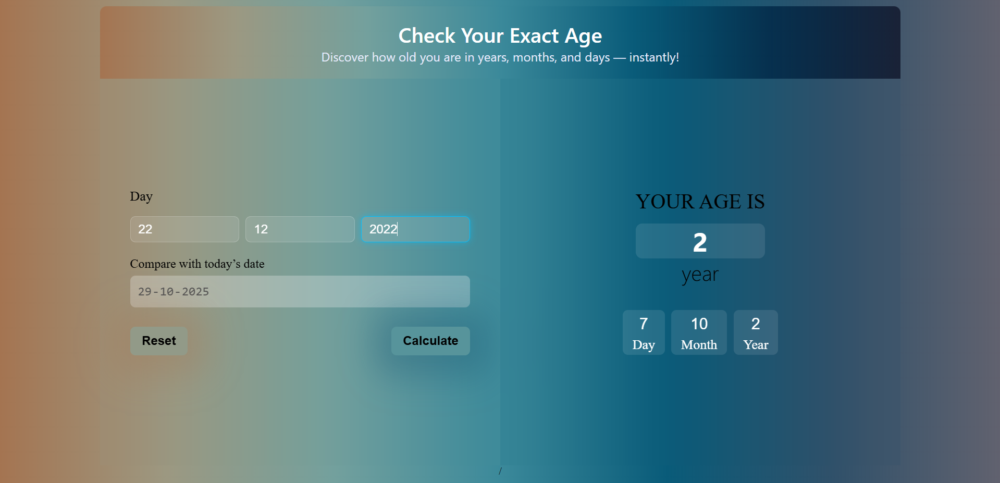
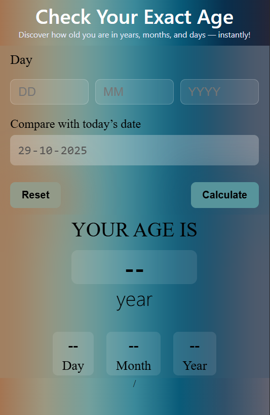

# 🧮 Age Calculator Web App

A modern and responsive **Age Calculator** built using **HTML, CSS, and JavaScript**.  
It lets users find their **exact age in years, months, and days** instantly — by comparing their birth date with today’s date.

---

## 🌐 Live Preview

👉 **Live Demo:** [Click Here to View the Project](https://your-live-link-here.vercel.app/)  

---

## 🖼️ Screenshot (Optional)
- Desktop Preview

- Smart phone

---

## 🚀 Features

✅ Auto-fills today’s date  
✅ Calculates exact age in years, months, and days  
✅ Handles invalid or future date inputs  
✅ Interactive and responsive design  
✅ Smooth blur-glass UI using CSS  
✅ Friendly alert messages and clean color transitions  

---

## 🛠️ Tech Stack

- **HTML5**
- **CSS3 (Flexbox + Media Queries)**   
- **Vanilla JavaScript (ES6)** 

---

## 💡 How It Works
- Enter your birth day, month, and year.

- The app compares your input with today’s date.

- You’ll see your exact age in:

- Years

- Months

- Days

- The design updates with color changes for better visibility.

## 👨‍💻 Author
 **Raviranjan** Kumar ❤️

